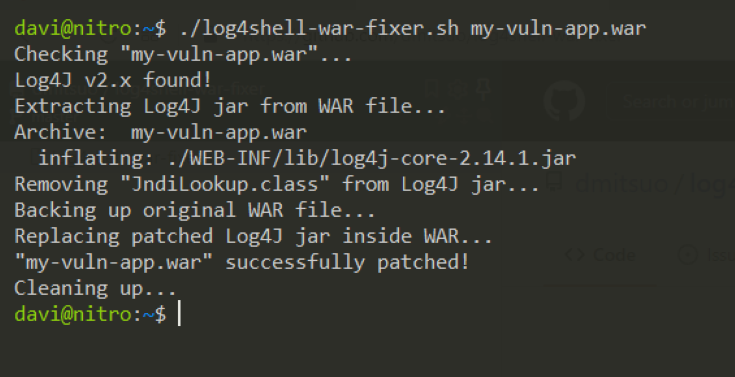

# log4shell-war-fixer

Linux shell script that patches a WAR file from #Log4Shell vulnerability (CVE-2021-44228).

It looks for <b><code>Log4j 2</code></b> jar file inside WAR file and remove <b><code>JndiLookup.class</code></b> if needed.

Usage:

<code>user@host:~$ <b>./log4shell-war-fixer.sh</b> my-vuln-app.war</code>

